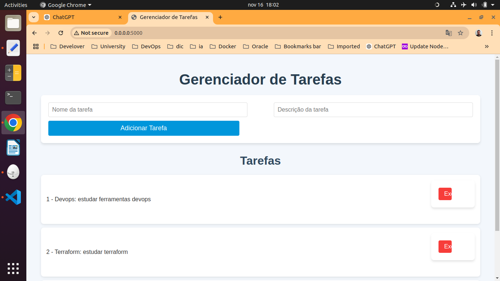

# DevOps CRUD Project with Flask on AWS

## Overview
This project is a full-stack DevOps application involving a simple CRUD app built with Python and Flask, containerized with Docker, provisioned on AWS using Terraform, integrated with CI/CD workflows using GitHub Actions, and monitored with Prometheus and Grafana.

## Project Structure
### 1. Application
- **Language**: Python
- **Framework**: Flask
- **Functionality**: Basic CRUD operations to manage simple items (e.g., a task list).
- **How it works**:
  


### 2. Containerization
- **Docker**:
  - `Dockerfile` to containerize the Flask application.
  - `docker-compose.yml` for local multi-container execution (optional).

### 3. Infrastructure as Code (IaC)
- **Terraform**:
  - Scripts to provision infrastructure on AWS.
    - Create an EC2 instance.
    - Configure Security Groups for secure access.
    - Ensure Docker is installed on the EC2 instance.

### 4. Version Control
- **GitHub**:
  - Repository for version control and collaboration.

### 5. CI/CD Pipeline
- **GitHub Actions**:
  - Workflow configuration for:
    - Running automated unit tests on the Flask application.
    - Building and pushing the Docker image to Docker Hub.
    - Deploying the image to the EC2 instance after pipeline approval.

### 6. Monitoring and Observability
- **Prometheus**:
  - Collect and scrape metrics from the application.
- **Grafana**:
  - Create dashboards for data visualization.
- **Flask Metrics Endpoint**:
  - Implement an endpoint for Prometheus to access application metrics.

## Getting Started
### Prerequisites
- **AWS Account** with access to manage EC2 instances.
- **Docker** and **Docker Compose** installed.
- **Terraform** installed.
- **GitHub Account**.
- **Prometheus** and **Grafana** for monitoring.

### Installation Steps
1. **Clone the Repository**:
   ```bash
   git clone https://github.com/yourusername/your-repo.git
   cd your-repo

2. **Build and Run the Docker Container**:
  ```bash
  docker build -t flask-crud-app .
  docker run -p 5000:5000 flask-crud-app
 ```
3.**Run with Docker Compose (Optional)**:
```bash
docker-compose up --build
```
### Infrastructure Deployment
1.**Navigate to the terraform directory**:
   ```bash
   cd terraform
  ```
2.**Initialize Terraform**:
  ```bash
  terraform init
  ```
3.**Apply the Terraform Configuration**:
  ```bash
  terraform apply
  ```
## CI/CD Workflow
### GitHub Actions will automatically:
- **Run unit tests on code push**.
- **Build and push Docker images**.
- **Deploy the updated app to the EC2 instance upon pipeline approval**.

### Monitoring Setup
1. **Expose a Prometheus Metrics Endpoint in the Flask app**:
    
    @app.route('/metrics')
    def metrics():
        # Example code for Prometheus metrics exposure

 2. **Configure Prometheus to scrape metrics from the Flask app**.
 3. **Set up Grafana for dashboard visualization**.

### License
This project is licensed under the MIT License.

### Contact
For further information or questions, please contact Jose Henrique.


This `README.md` provides a comprehensive guide for setting up and running the project. Let me know if you need any changes or additional sections!


